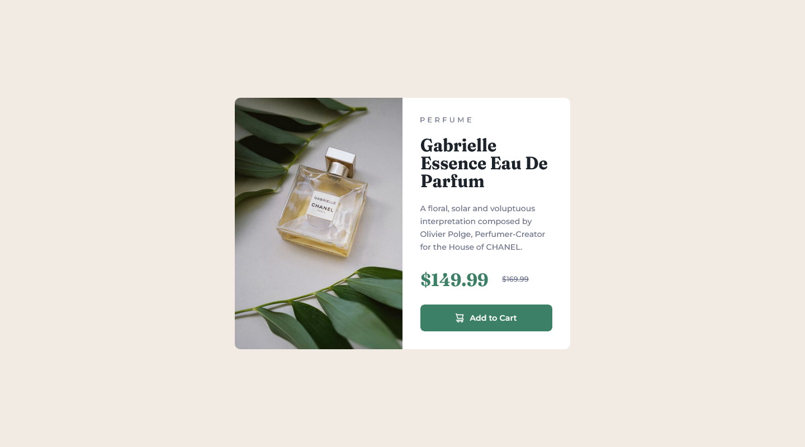

# Frontend Mentor - Product preview card component solution

This is a solution to the [Product preview card component challenge on Frontend Mentor](https://www.frontendmentor.io/challenges/product-preview-card-component-GO7UmttRfa). Frontend Mentor challenges help you improve your coding skills by building realistic projects. 

## Table of contents

- [Overview](#overview)
  - [The challenge](#the-challenge)
  - [Screenshot](#screenshot)
  - [Links](#links)
- [My process](#my-process)
  - [Built with](#built-with)
  - [What I learned](#what-i-learned)
  - [Useful resources](#useful-resources)
- [Author](#author)

## Overview

### The challenge

Users should be able to:

- View the optimal layout depending on their device's screen size
- See hover and focus states for interactive elements

### Screenshot




### Links

- Solution URL: [Solution](https://www.frontendmentor.io/solutions/css-grid-flexbox-ti41IESVnD)
- Live Site URL: [Live Site](https://james-alderson.github.io/FrontendMentor_Product-preview-card-component/)

## My process

### Built with

- Semantic HTML5 markup
- CSS custom properties
- Flexbox
- CSS Grid
- Mobile-first workflow
- [BEM](https://en.bem.info/methodology/) methodology

### What I learned

In this project I learned to used `<picture>` tag. by using `<picture>` tag Instead of having one image that is scaled up or down based on the viewport width, multiple images can be designed to more nicely fill the browser viewport.

The `<picture>` element contains two tags: one or more `<source>` tags and one `` tag.

The browser will look for the first `<source>` element where the media query matches the current viewport width, and then it will display the proper image (specified in the srcset attribute). The `` element is required as the last child of the `<picture>` element, as a fallback option if none of the source tags matches.

Use this section to recap over some of your major learnings while working through this project. Writing these out and providing code samples of areas you want to highlight is a great way to reinforce your own knowledge.

To see how you can add code snippets, see below:

```html
<picture>
  <source 
    srcset="./assets/images/image-product-desktop.jpg"
    media="(min-width: 600px)"
  />
  
</picture>
```
### Useful resources

- [MDN](https://developer.mozilla.org/en-US/docs/Web/HTML/Element/picture) - This helped me to use the `<picture>` element.

## Author

- Frontend Mentor - [@James-alderson](https://www.frontendmentor.io/profile/James-alderson)
